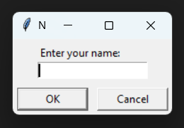
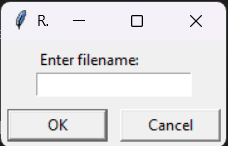
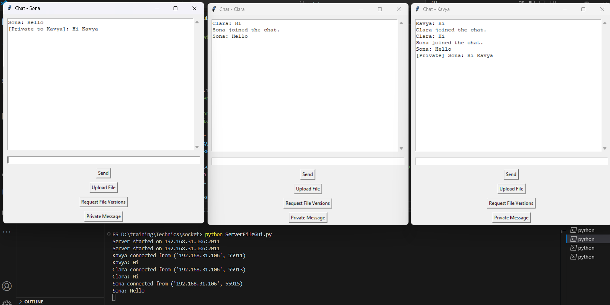

# LayerFileChat

**Chat, upload, and restore — a Python socket-based GUI app for real-time messaging and versioned file sharing.**

LayerFileChat is a multi-client desktop application built with Python's `socket` and `Tkinter` libraries. It allows users to chat in real time, upload and manage files collaboratively, and restore any previous version of a file — all from a simple graphical interface.

Built with:

- Python `socket`, `threading`
- `tkinter` GUI
- Local file storage for version history

## ✨ Features

- ✅ **Multi-client real-time chat**
- ✅ **File upload with automatic versioning**
- ✅ **Version history access and restoration**
- ✅ **Private messaging between users**
- ✅ **Tkinter GUI for easy interaction**
- ✅ **Separate folders for saved server and client files**

## 💻 How It Works

### 🖥️ Server

Run `ServerFileGui.py` to start the server. It listens on a specified IP and port, accepts multiple clients, and stores versioned files in `server_files/`.

### 👥 Client

Run `ClientFileGui.py` from multiple instances. Features include:

- Public chat
- File upload (each update creates a version)
- Requesting available versions
- Viewing/restoring versions
- Sending private messages

## 📸 Screenshots

### Client Name and File Name(Version or Upload)

 

### Client Chats and Server Running below

### Version Selection Box

## 🚀 How to Run

1. Update `SERVER_IP` and `PORT` in both Python files
2. Start `ServerFileGui.py`
3. Run `ClientFileGui.py` from multiple terminals
4. Enjoy chatting and versioned file sharing!

## 📁 Folder Structure

`LayerFileChat/`

`├── ServerFileGui.py # Server script (run first)`

`├── ClientFileGui.py # Client GUI script (can be run by multiple users)`

`├── screenshots/ # Contains output screenshots`

`│ ├── server_running.png`

`│ ├── client_upload.png`

`│ ├── version_selection.png`

`│ └── file_restore.png`

`└── README.md`
